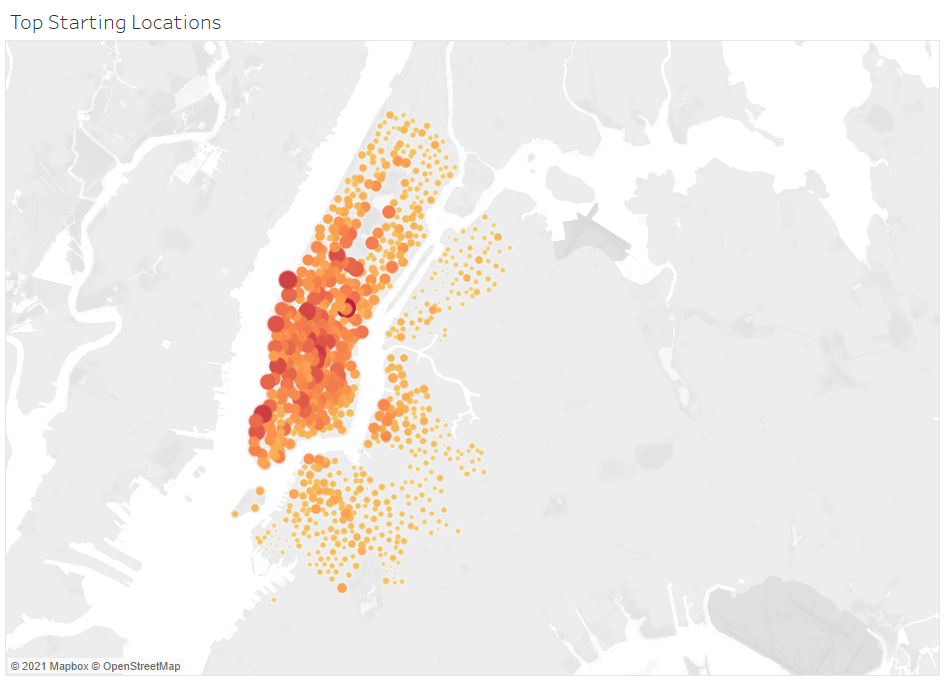

# bikesharing
Data Analytics Boot Camp Module 14 Challenge

# Analysis Overview

The objective of this analysis is to convince investors that a ***bike-sharing*** program in *Des Moines* is a solid business proposal.

In this analysis, I will analyze a similar ***bike-sharing*** program in *NYC*:

1. Show the length of time that bikes are checked out for all riders and genders
2. Show the number of bike trips for all riders and genders for each hour of each day of the week
3. Show the number of bike trips for each type of user and gender for each day of the week
4. Top starting locations
5. A visual to easily identify which bikes are due for repairs

# Results

## Checkout Times for Users

This visual illustrates the total trip duration for all users in hours and minutes. The visual contains a filter for the total trip duration in hours

## Checkout Times by Gender

This visual is similar to the one above with the added ability to view the trip duration by gender

## Trips by Weekday for Each Hour

This heat map illustrates the day of the week and hour of the day with peak trips

## Trips by Gender (Weekday per Hour)

This visual is similar to the one above with the added ability to view the peak hours and weekdays by gender

## User Trips by Gender by Weekday

This visual illustrates the total trips by usertype and gender for each day of the week

## Top Starting Locations

This map visual illustrates the areas of the city with the highest number trips per starting location

## Bike Repairs

Finally, this visual helps easily identify which bikes are due for repairs

# Summary

In summary, a few findings are worth pointing out:
1. Most trips are less the one hour long
2. Peak hours for trips are early mornings (7-9am) and evenings (5-7pm)
3. Males are more probably to use the service
4. Subscribers use the service the most

I would add the following two visuals to better understand user behavior:
- Number of trips by user's age. A bar chart sliced by gender
- Average trip duration by user's age and gender

# Tableau Public link

My Tableau story can be accessed via:

[link to dashboard](https://public.tableau.com/app/profile/saeed.al.yacoubi/viz/Challenge14_16218959103540/NYCBikesharingAnalysis "Bikesharing Analysis")

---

